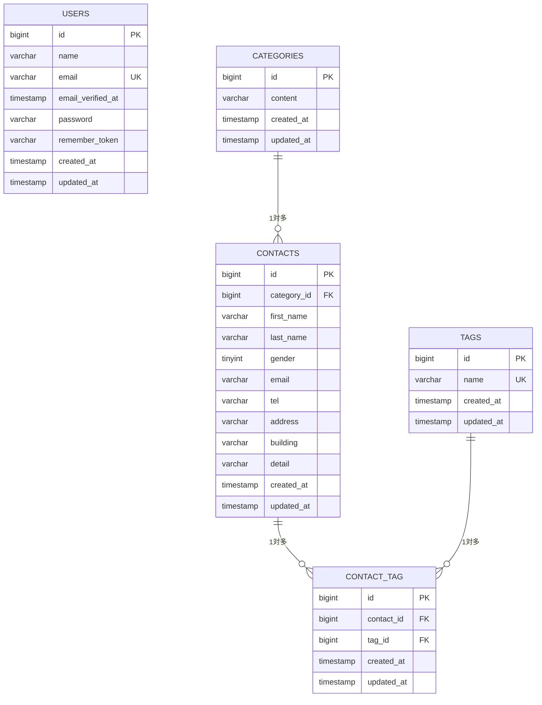

# COACHTECH お問い合わせフォーム

## 概要

Laravel 10 を用いて構築したお問い合わせ管理アプリケーションです。一般ユーザーが公開フォームからお問い合わせを送信でき、管理者はログイン後に内容の確認・検索・削除・CSV エクスポート・タグ管理を行えます。公開 API からもお問い合わせの CRUD 操作が可能です。

主な実装機能：

- お問い合わせの送信・確認・保存
- カテゴリ・タグによるお問い合わせ分類
- 管理画面での一覧表示・検索・詳細確認・削除
- CSV エクスポート
- タグの作成・編集・削除
- 管理画面への認証制御（Laravel Fortify）
- 公開 REST API（お問い合わせ CRUD）

## ER 図



## 使用技術

| 技術 | バージョン |
| --- | --- |
| PHP | 8.2 |
| Laravel | 10.x |
| MySQL | 8.0 |
| Nginx | Web サーバー |
| Docker / Laravel Sail | 開発環境 |
| Laravel Fortify | 認証 |
| Tailwind CSS | スタイリング |
| Vite | フロントエンドビルド |

## 環境構築手順

### 1. リポジトリをクローン

```bash
git clone <リポジトリURL>
cd contact-form-app
```

### 2. 環境変数ファイルを作成

```bash
cp .env.example .env
```

### 3. Composer パッケージをインストール

```bash
composer install
```

### 4. Docker コンテナを起動

```bash
./vendor/bin/sail up -d
```

### 5. アプリケーションキーを生成

```bash
./vendor/bin/sail artisan key:generate
```

### 6. マイグレーションと初期データの投入

```bash
./vendor/bin/sail artisan migrate --seed
```

### 7. フロントエンドの依存関係をインストールしてビルド

```bash
npm install
npm run dev
```

## API エンドポイント一覧

ベース URL: `/api/v1`

| メソッド | パス | 概要 |
| --- | --- | --- |
| GET | `/api/v1/contacts` | お問い合わせ一覧を取得（検索・ページネーション対応） |
| GET | `/api/v1/contacts/{contact}` | 指定したお問い合わせの詳細を取得 |
| POST | `/api/v1/contacts` | お問い合わせを新規登録 |
| PUT | `/api/v1/contacts/{contact}` | 指定したお問い合わせを更新 |
| DELETE | `/api/v1/contacts/{contact}` | 指定したお問い合わせを削除 |

## 開発環境 URL

| 種別 | URL |
| --- | --- |
| お問い合わせフォーム | http://localhost |
| 管理画面 | http://localhost/admin |
| phpMyAdmin | http://localhost:8080 |

初期管理者アカウント：

```text
email: test@example.com
password: password
```

## 作成者

[名前]
