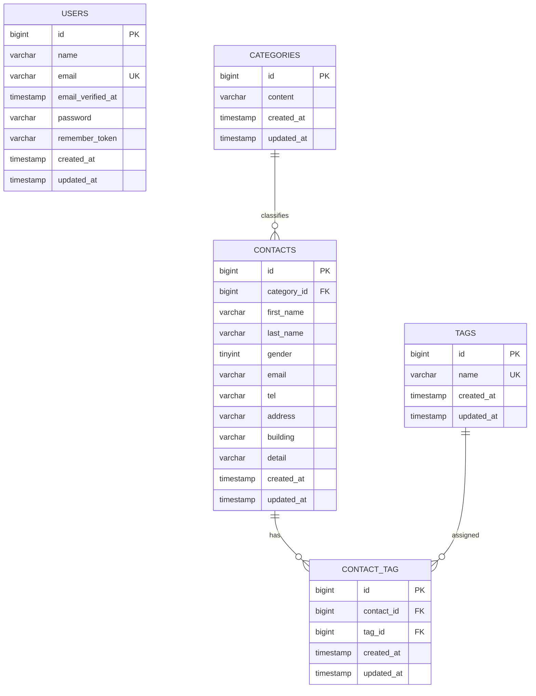

# お問い合わせフォーム

Laravel 10で構築したお問い合わせ管理アプリケーションです。一般ユーザーはお問い合わせを送信でき、管理者は認証後に検索・詳細確認・削除・CSV出力・タグ管理を行えます。公開APIからもお問い合わせのCRUD操作が可能です。

## 環境構築

```bash
git clone <repository-url>
cd contact-form-app
cp .env.example .env
composer install
./vendor/bin/sail up -d
./vendor/bin/sail artisan key:generate
./vendor/bin/sail artisan migrate --seed
npm install
npm run dev
```

## URL

- お問い合わせフォーム: `http://localhost`
- 管理画面: `http://localhost/admin`
- phpMyAdmin: `http://localhost:8080`
- 公開API: `http://localhost/api/v1/contacts`

初期管理者:

```text
email: test@example.com
password: password
```

## テスト

```bash
./vendor/bin/sail artisan test
./vendor/bin/sail artisan test --coverage
```

## ER図



`contact_tag` には `UNIQUE(contact_id, tag_id)` 制約があります。

## 使用技術

- PHP 8.2
- Laravel 10
- MySQL 8.0
- Laravel Fortify
- Laravel Sail
- Tailwind CSS
- Vite
